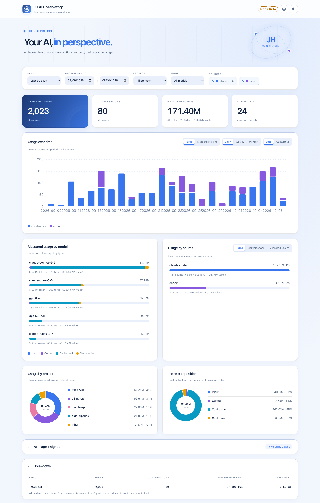

# JH AI Observatory

A local dashboard that shows how you use AI coding agents (Claude Code and
Codex), built from the logs those tools already write to your machine.



<sub>Screenshot taken in mock-data mode. All numbers and projects are generated.</sub>

## Why

Coding agents write detailed per-turn logs, but there's no simple way to see
the whole picture: which models you lean on, which projects use the most
tokens, how much of it is cache, and what it would cost at API list prices.
JH AI Observatory reads those logs and shows exactly what happened, with no
estimates or invented numbers:

- **Measured, not guessed.** Every number comes from real token counts in the
  logs. Missing data shows as `—` and unknown models show as *Unpriced*, never `0`.
- **Local first.** Nothing leaves your machine. The server binds to `127.0.0.1`
  and has no dependencies, telemetry or CDN.
- **Usage vs. cost kept apart.** *API value\** prices each turn at list API
  rates for reference. It isn't your subscription bill.

## Features

- Usage over time (daily / weekly / monthly), by model, source, project and tag
- Token composition: input, output, cache read, cache write
- Filters for date range, project, model and source; optional `personal` / `work` tags
- Incremental ingest that refreshes on its own every 5 minutes
- Built-in price table with overrides, plus an API cost calculator
- Optional **AI usage insights**: sends the filtered summary (not raw logs) to
  the Anthropic API using your own key, which is kept only in your browser
- Light and dark themes, a terminal summary (`stats`), and a read-only JSON API

| Source | Reads |
|---|---|
| Claude Code | `~/.claude/projects/**/*.jsonl` |
| Codex | `~/.codex/sessions/**/rollout-*.jsonl` |

## Quick start

Requires **Node.js 18+**. There's nothing to install.

```bash
git clone https://github.com/JessamyH/jh-ai-observatory.git
cd jh-ai-observatory

npm run serve        # collect usage and start the dashboard
#   -> http://127.0.0.1:4317
```

On first run, `config.json` is created from `config.example.json`. Open
**Settings → Detection directories**, add the folders that hold your projects
(for example `~/Developer`), and click **Save & collect**. Each first-level
folder under a directory you add counts as a project.

On macOS you can also double-click **Launch Observatory.command** in Finder.

### Try it with demo data

```bash
npm run demo         # -> http://127.0.0.1:4318
```

This serves 90 days of generated usage without reading your logs. It's safe for
demos and screenshots. **Launch Mock Data.command** does the same thing on macOS.

### Other commands

```bash
npm run ingest       # collect usage into data/store.json
npm run stats        # print a summary in the terminal
npm test             # run the test suite (node:test, no dependencies)
```

## Privacy

- Logs are read locally and the store is written to `data/`, which is git-ignored.
- The dashboard is served on `127.0.0.1` only.
- AI insights are off until you add an API key. When used, only the aggregated
  summary for the current filter is sent to Anthropic.

## Documentation

See [docs/DEVELOPMENT.md](docs/DEVELOPMENT.md) for configuration, tags, pricing
rules, the data model, architecture, the JSON API and how to add a new source.

## License

[MIT](LICENSE)
