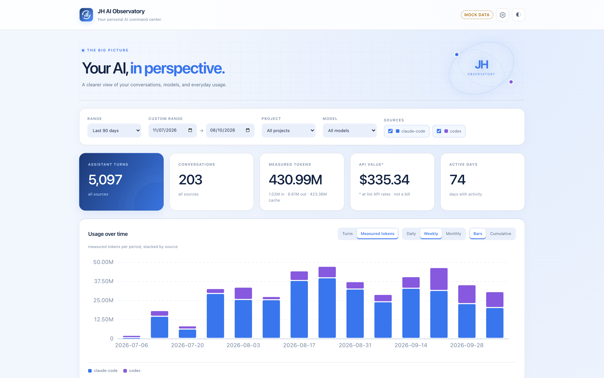
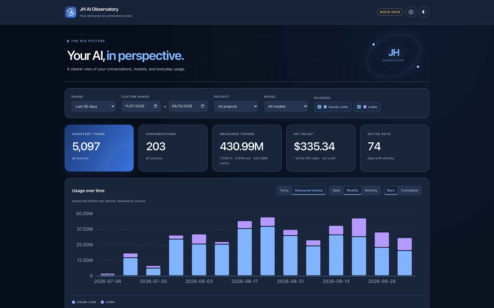
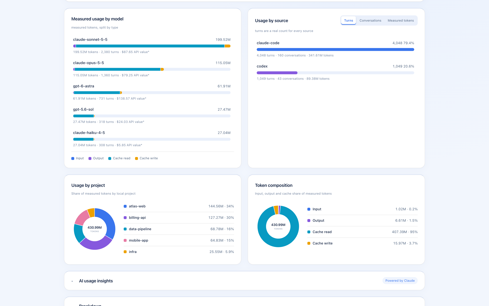
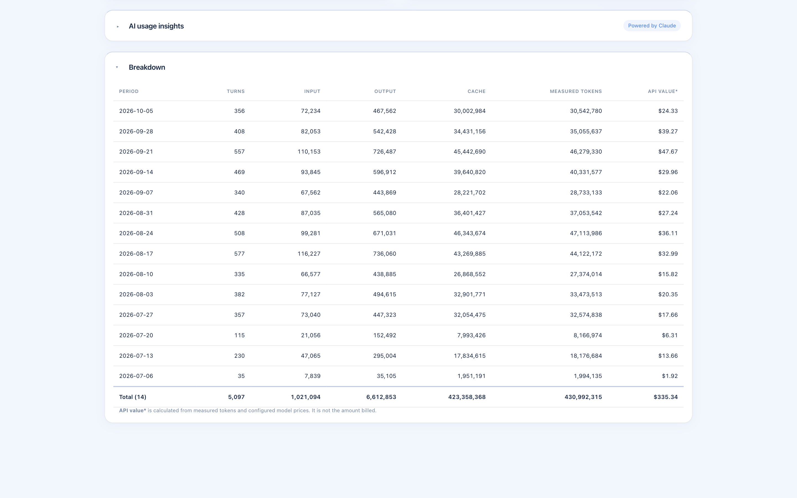
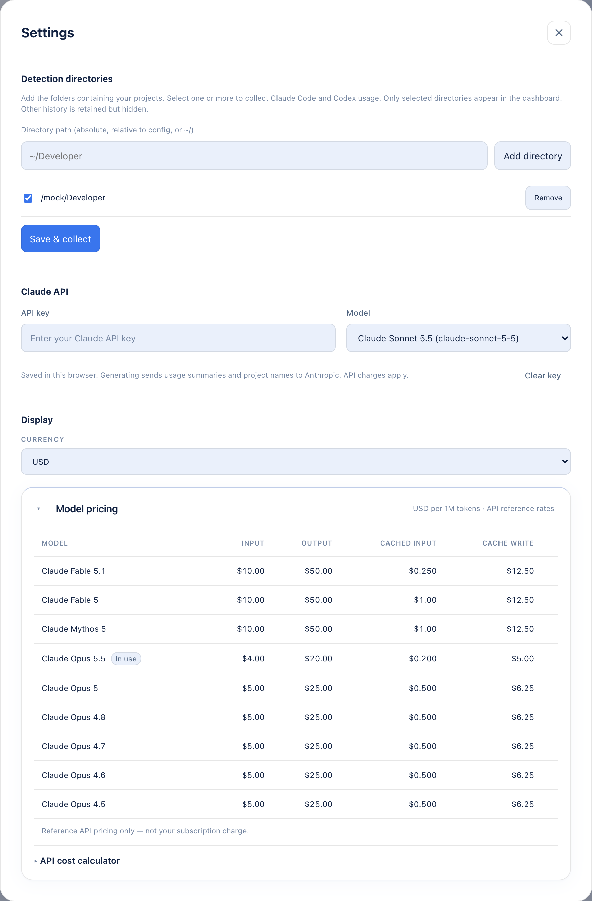
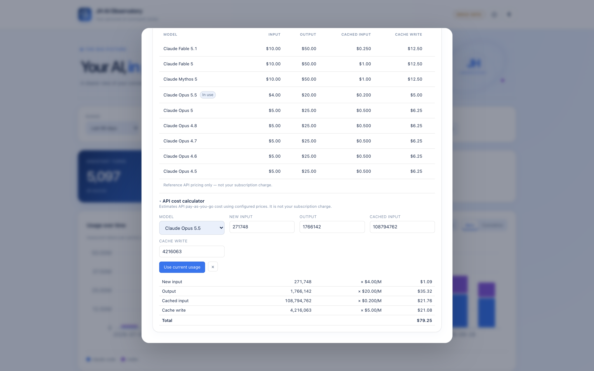

# JH AI Observatory

A local dashboard that shows how you actually use AI coding agents.

See your Claude Code and Codex usage by model, project and day, with token counts taken straight from the logs those tools already write to your machine.

> **No dependencies. No build step. No cloud.**
> Run `npm run serve` and open the dashboard.

## 📸 Screenshots

<p align="center">
  
  
</p>
<p align="center">
  
  
</p>
<p align="center">
  
  
</p>

<p align="center"><sub>All screenshots use the built-in mock data. Every number and project name is generated.</sub></p>

## ✨ Philosophy

JH AI Observatory is intentionally strict about its numbers.

* ✅ Measured, not guessed: every figure comes from real token counts in the logs
* ✅ Missing data shows as `—` and unknown models as *Unpriced*, never `0`
* ✅ Usage and cost are kept apart, so *API value\** is a list-price reference, not your bill
* ✅ Local only: the server binds to `127.0.0.1`, with no telemetry and no CDN

## 🚀 Features

### 📊 Usage

#### Overview

Turns, conversations, measured tokens, API value\* and active days at a glance, plus a usage-over-time chart you can switch between turns and tokens, daily, weekly or monthly, and bars or cumulative.

#### Breakdowns

See where usage goes by model (split into input, output, cache read and cache write), by source, by project, and by overall token composition. Click a slice to filter the whole dashboard.

#### Breakdown Table

A per-period table of turns, tokens and API value, with totals.

#### Filters

Filter by date range, project, model and source.

### 💲 Pricing

#### Model Pricing

A built-in table of reference API rates per model, including cache-read and cache-write multipliers. Override or add rates in `config.json`.

#### API Cost Calculator

Price a hypothetical request by typing token counts (`100k`, `1.5m`), or load the totals for the current filter in one click.

### 🔄 Collection

Reads local logs incrementally: unchanged files are skipped, and new usage is collected every 5 minutes or on demand with **⟳**.

| Source | Reads |
|---|---|
| Claude Code | `~/.claude/projects/**/*.jsonl` |
| Codex | `~/.codex/sessions/**/rollout-*.jsonl` |

### 🎨 Themes

Switch between light and dark from the header.

### 🤖 AI Insights *(Optional)*

Get a short AI read of the selected period: three findings and three practical actions, based on model mix, project concentration and cache share. Only the aggregated summary is sent to the Anthropic API, using your own key, which is stored in your browser only.

## 🚀 Getting Started

Requires **Node.js 18+**. There's nothing to install.

```bash
git clone https://github.com/JessamyH/jh-ai-observatory.git
cd jh-ai-observatory

npm run serve        # collect usage and start the dashboard
#   -> http://127.0.0.1:4317
```

1. On first run, `config.json` is created from `config.example.json`
2. Open **Settings → Detection directories** and add the folders that hold your projects (for example `~/Developer`)
3. Click **Save & collect**. Each first-level folder under a directory you add counts as a project

On macOS you can also double-click **Launch Observatory.command** in Finder.

### Try it with demo data

```bash
npm run demo         # -> http://127.0.0.1:4318
```

This serves 90 days of generated usage and never reads your logs, so it's safe for demos and screenshots. **Launch Mock Data.command** does the same thing on macOS.

### Other commands

```bash
npm run ingest       # collect usage into data/store.json
npm run stats        # print a summary in the terminal
npm test             # run the test suite
```

## 🔒 Privacy

* Logs are read locally, and the store is written to `data/`, which is git-ignored
* The dashboard is served on `127.0.0.1` only
* No data leaves your machine unless you add an API key and generate AI insights yourself

## 🛠 Tech Stack

* Node.js (built-in modules only)
* Vanilla JavaScript
* Hand-rolled SVG charts
* No frameworks
* No build tools
* `node:test` for tests

## 📚 Documentation

See [docs/DEVELOPMENT.md](docs/DEVELOPMENT.md) for configuration, pricing rules, the data model, architecture, the JSON API, and how to add a new source.

## 📄 License

Released under the **MIT License**. See [LICENSE](LICENSE).
